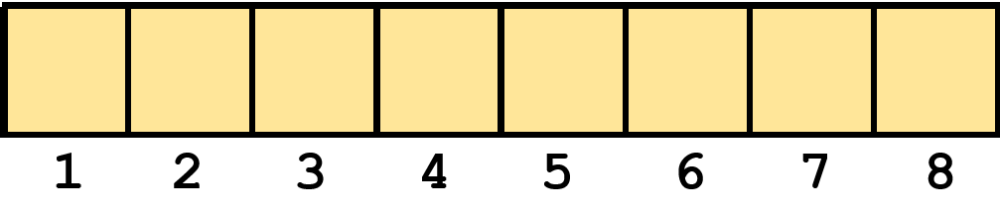

# [*The list data structure.*]{.underline}

# [*Loops.*]{.underline}

# [*The "if...else" statement*]{.underline}

# **Learning goals**

-   Understand the `list` data structure. Refs: [HOPR](https://rstudio-education.github.io/hopr/r-objects.html#lists), [R4DS](https://r4ds.had.co.nz/vectors.html#lists).

-   Be able to use [`for` and `while` loops](https://rstudio-education.github.io/hopr/loops.html) in R

-   Be able to make use of conditionals ([`if` statements](https://rstudio-education.github.io/hopr/programs.html#if-statements)) in R code

# **R Recall Basic Data Types**

1.  Numeric:

    -   Represents numerical values, both integers and decimals.

    -   Commonly used for quantitative measurements and calculations.

    -   Example: 10.0, 3.14, -5.2

2.  Character:

    -   Represents textual data, such as symbols, words, sentences.

    -   Enclosed in quotation marks (" ") or single quotes (' ').

    -   Example: "Hello", "1.0", 'R programming'

3.  Logical:

    -   Represents Boolean values: TRUE or FALSE.

    -   Used for logical comparisons and conditional operations.

    -   Example: TRUE, FALSE

4.  Integer:

    -   Represents whole numbers without decimal points.

    -   Used for precise calculations and indexing operations.

    -   Example: 20, -7, 0

# **R Data Structures**

*Data structure is the form of organizing and storing the data in programming.\
**R has the following common data structures:***

-   [vector]{.underline} (you already know)

-   matrix

-   array

-   **list** (we shall learn today)

-   data frame

[{width="352"}](data:image/jpeg;base64,/9j/4AAQSkZJRgABAQEAkACQAAD/4RDmRXhpZgAATU0AKgAAAAgABQESAAMAAAABAAEAAAE7AAIAAAAFAAAIVodpAAQAAAABAAAIXJydAAEAAAAKAAAQ1OocAAcAAAgMAAAASgAAAAAc6gAAAAgAAAAAAAAAAAAAAAAAAAAAAAAAAAAAAAAAAAAAAAAAAAAAAAAAAAAAAAAAAAAAAAAAAAAAAAAAAAAAAAAAAAAAAAAAAAAAAAAAAAAAAAAAAAAAAAAAAAAAAAAAAAAAAAAAAAAAAAAAAAAAAAAAAAAAAAAAAAAAAAAAAAAAAAAAAAAAAAAAAAAAAAAAAAAAAAAAAAAAAAAAAAAAAAAAAAAAAAAAAAAAAAAAAAAAAAAAAAAAAAAAAAAAAAAAAAAAAAAAAAAAAAAAAAAAAAAAAAAAAAAAAAAAAAAAAAAAAAAAAAAAAAAAAAAAAAAAAAAAAAAAAAAAAAAAAAAAAAAAAAAAAAAAAAAAAAAAAAAAAAAAAAAAAAAAAAAAAAAAAAAAAAAAAAAAAAAAAAAAAAAAAAAAAAAAAAAAAAAAAAAAAAAAAAAAAAAAAAAAAAAAAAAAAAAAAAAAAAAAAAAAAAAAAAAAAAAAAAAAAAAAAAAAAAAAAAAAAAAAAAAAAAAAAAAAAAAAAAAAAAAAAAAAAAAAAAAAAAAAAAAAAAAAAAAAAAAAAAAAAAAAAAAAAAAAAAAAAAAAAAAAAAAAAAAAAAAAAAAAAAAAAAAAAAAAAAAAAAAAAAAAAAAAAAAAAAAAAAAAAAAAAAAAAAAAAAAAAAAAAAAAAAAAAAAAAAAAAAAAAAAAAAAAAAAAAAAAAAAAAAAAAAAAAAAAAAAAAAAAAAAAAAAAAAAAAAAAAAAAAAAAAAAAAAAAAAAAAAAAAAAAAAAAAAAAAAAAAAAAAAAAAAAAAAAAAAAAAAAAAAAAAAAAAAAAAAAAAAAAAAAAAAAAAAAAAAAAAAAAAAAAAAAAAAAAAAAAAAAAAAAAAAAAAAAAAAAAAAAAAAAAAAAAAAAAAAAAAAAAAAAAAAAAAAAAAAAAAAAAAAAAAAAAAAAAAAAAAAAAAAAAAAAAAAAAAAAAAAAAAAAAAAAAAAAAAAAAAAAAAAAAAAAAAAAAAAAAAAAAAAAAAAAAAAAAAAAAAAAAAAAAAAAAAAAAAAAAAAAAAAAAAAAAAAAAAAAAAAAAAAAAAAAAAAAAAAAAAAAAAAAAAAAAAAAAAAAAAAAAAAAAAAAAAAAAAAAAAAAAAAAAAAAAAAAAAAAAAAAAAAAAAAAAAAAAAAAAAAAAAAAAAAAAAAAAAAAAAAAAAAAAAAAAAAAAAAAAAAAAAAAAAAAAAAAAAAAAAAAAAAAAAAAAAAAAAAAAAAAAAAAAAAAAAAAAAAAAAAAAAAAAAAAAAAAAAAAAAAAAAAAAAAAAAAAAAAAAAAAAAAAAAAAAAAAAAAAAAAAAAAAAAAAAAAAAAAAAAAAAAAAAAAAAAAAAAAAAAAAAAAAAAAAAAAAAAAAAAAAAAAAAAAAAAAAAAAAAAAAAAAAAAAAAAAAAAAAAAAAAAAAAAAAAAAAAAAAAAAAAAAAAAAAAAAAAAAAAAAAAAAAAAAAAAAAAAAAAAAAAAAAAAAAAAAAAAAAAAAAAAAAAAAAAAAAAAAAAAAAAAAAAAAAAAAAAAAAAAAAAAAAAAAAAAAAAAAAAAAAAAAAAAAAAAAAAAAAAAAAAAAAAAAAAAAAAAAAAAAAAAAAAAAAAAAAAAAAAAAAAAAAAAAAAAAAAAAAAAAAAAAAAAAAAAAAAAAAAAAAAAAAAAAAAAAAAAAAAAAAAAAAAAAAAAAAAAAAAAAAAAAAAAAAAAAAAAAAAAAAAAAAAAAAAAAAAAAAAAAAAAAAAAAAAAAAAAAAAAAAAAAAAAAAAAAAAAAAAAAAAAAAAAAAAAAAAAAAAAAAAAAAAAAAAAAAAAAAAAAAAAAAAAAAAAAAAAAAAAAAAAAAAAAAAAAAAAAAAAAAAAAAAAAAAAAAAAAAAAAAAAAAAAAAAAAAAAAAAAAAAAAAAAAAAAAAAAAAAAAAAAAAAAAAAAAAAAAAAAAAAAAAAAAAAAAAAAAAAAAAAAAAAAAAAAAAAAAAAAAAAAAAAAAAAAAAAAAAAAAAAAAAAAAAAAAAAAAAAAAAAAAAAAAAAAAAAAAAAAAAAAAAAAAAAAAAAAAAAAAAAAAAAAAAAAAAAAAAAAAAAAAAAAAAAAAAAAAAAAAAAAAAAAAAAAAAAAAAAAAAAAAAAAAAAAAAAAAAAAAAAAAAAAAAAAAAAAAAAAAAAAAAAAAAAAAAAAAAAAAAAAAAAAAAAAAAAAAAAAAAAAAAAAAAAAAAAAAAAAAAAAAAAAAAAAAAAAAAAAAAAAAAAAAAAAAAAAAAAAAAAAAAAAAAAAAAAAAAAAAAAAAAAAAAAAAAAAAAAAAAAAAAAAAAAAAAAAAAAAAAAAAAAAAAAAAAAAAAAAAAAAAAAAAAAAAAAAAAAAAAAAAAAAAAAAAAAAAAAAAAAAAAAAAAAAAAAAAAAAAAAAAAAAAAAAAAAAAAAAAAAAAAAAAAAAAAAAAAAAAAAAAAAAAAAAAAAAAAAAAAAAAAAAAAAAAAAAAAAAAAAAAAAAAAAAAAAAAAAAAAAAAAAAAAAAAAAAAAAAAAAAAAAAAAAAAAAAAAAAAAAAAAAAAAAAAAAAAAAAAAAAAAAAAAAAAAAAAAAAAAAAAAAAAAAAAAAAAAAAAAAAAAAAAAAAAAAAAAAAAAAAAAAAAAAAAAAAAAAAAAAAAAAAAAAAAAAAAAAAAAAAAAAAAAAAAAAAAAAAAAAAAAAAAAAAAAAAAAAAAAAAAAAAAAAAAAAAAAAAAAAAAAAAAAAAAAAAAAAAAAAAEVjaG8AAAAFkAMAAgAAABQAABCqkAQAAgAAABQAABC+kpEAAgAAAAM5NAAAkpIAAgAAAAM5NAAA6hwABwAACAwAAAieAAAAABzqAAAACAAAAAAAAAAAAAAAAAAAAAAAAAAAAAAAAAAAAAAAAAAAAAAAAAAAAAAAAAAAAAAAAAAAAAAAAAAAAAAAAAAAAAAAAAAAAAAAAAAAAAAAAAAAAAAAAAAAAAAAAAAAAAAAAAAAAAAAAAAAAAAAAAAAAAAAAAAAAAAAAAAAAAAAAAAAAAAAAAAAAAAAAAAAAAAAAAAAAAAAAAAAAAAAAAAAAAAAAAAAAAAAAAAAAAAAAAAAAAAAAAAAAAAAAAAAAAAAAAAAAAAAAAAAAAAAAAAAAAAAAAAAAAAAAAAAAAAAAAAAAAAAAAAAAAAAAAAAAAAAAAAAAAAAAAAAAAAAAAAAAAAAAAAAAAAAAAAAAAAAAAAAAAAAAAAAAAAAAAAAAAAAAAAAAAAAAAAAAAAAAAAAAAAAAAAAAAAAAAAAAAAAAAAAAAAAAAAAAAAAAAAAAAAAAAAAAAAAAAAAAAAAAAAAAAAAAAAAAAAAAAAAAAAAAAAAAAAAAAAAAAAAAAAAAAAAAAAAAAAAAAAAAAAAAAAAAAAAAAAAAAAAAAAAAAAAAAAAAAAAAAAAAAAAAAAAAAAAAAAAAAAAAAAAAAAAAAAAAAAAAAAAAAAAAAAAAAAAAAAAAAAAAAAAAAAAAAAAAAAAAAAAAAAAAAAAAAAAAAAAAAAAAAAAAAAAAAAAAAAAAAAAAAAAAAAAAAAAAAAAAAAAAAAAAAAAAAAAAAAAAAAAAAAAAAAAAAAAAAAAAAAAAAAAAAAAAAAAAAAAAAAAAAAAAAAAAAAAAAAAAAAAAAAAAAAAAAAAAAAAAAAAAAAAAAAAAAAAAAAAAAAAAAAAAAAAAAAAAAAAAAAAAAAAAAAAAAAAAAAAAAAAAAAAAAAAAAAAAAAAAAAAAAAAAAAAAAAAAAAAAAAAAAAAAAAAAAAAAAAAAAAAAAAAAAAAAAAAAAAAAAAAAAAAAAAAAAAAAAAAAAAAAAAAAAAAAAAAAAAAAAAAAAAAAAAAAAAAAAAAAAAAAAAAAAAAAAAAAAAAAAAAAAAAAAAAAAAAAAAAAAAAAAAAAAAAAAAAAAAAAAAAAAAAAAAAAAAAAAAAAAAAA)

## **The `vector`**

{width="461"}

```{r}
#vector of characters
names <- c("Lars", "Hilde", "Alex")
print(names)
#vector of integers
numbers <- 1:10
print(numbers)
names[2]
numbers[4]
```

But we cannot handle multiple data types inside a vector

```{r}
# if we try
mixed_vector <- c(1,"New Year",TRUE)

# everything is casted to the most gereral character type
print(mixed_vector)
```

## **The `list`**

The list is in many ways **like a vector**, but the **big difference is that a list can store 'anything'**. The first element may be a number, the second a text, the third a table, the fourth a new list, and so on. So why don't we always use a list instead of a vector? Because this versatility comes with a cost. A list is more cumbersome to use, we no longer have the fast and elegant *vectorization* of code that is so typical for many R programs. [**Cost**]{.underline} **of adding or accessing an element in a list is higher than that of a vector.**

**In general** we can say:

-   We use vectors (or matrices and tables) whenever we ***can*****.**

-   We use lists when we ***have to*****.**

## **Creating lists**

To create a list we use the list command

```{r}

my.list <- list("Donald",
                c(Age = 71, Weight = 120, Height = 187), FALSE)
print(my.list)

my.list <- list(Name = "Donald",
                Data = c(Age = 71, Weight = 120, Height = 187),
                Is.female = FALSE)
print(my.list)


```

Here we named each element in the list, which is not required but often done. The first element is a text, the second is a (named) vector of numbers, and the third is a `logical`.

Get length

```{r}
length(my.list)
```

Sometimes we create an empty `list` that we later fill in, and this is done by

```{r}
a <- list()
print(a)
#append on the right
a <- c(a,race = "duck",wealth = 10)
print(a)
a <- c(a,FALSE)
print(a)
#append on the left
a <- c(log = TRUE,a)
print(a)
```

Multiple lists can be merged with all those lists into one single list structure

```{r}
my.list <- c(my.list,a)
print(my.list)
```

## **Indexing a list**

If we have a **named** list we can use the `$` operator to access the elements:

```{r}
my.list$Data
```

We can also use the `$` notation to add a new named element to an existing list:

```{r}
my.list$Copyright <- "Disney"
my.list
```

and the element named **Copyright** is added to `my.list`. Note that had we used an existing name, the content of that element had now been changed, without any warning!

In some cases the elements have no names, or we need to access all elements in a (long) list. It is impossible/impractical to use names in such cases, and we need to access the elements by index, i.e. the position they have in the `list`. If we do it as we did for vectors:

```{r}
print(my.list)
x <- my.list[6]
print(x)
print(typeof(x))
#x-2
```

you can observe that `x` is now another list of length 1. Thus, a simple index will only subset the list, and not really give us access to the ***content*** of the list-elements. To get this we must use double brackets:

```{r}
x <- my.list[[6]]
print(x)
print(typeof(x))
x-2
```

This time `x` is the integer which is the ***content*** of the 6th list-element that is an instance of the integer class.

Please note this right away:

-   Think of a list as a series of list-elements (**bags**)

-   Using single brackets **[]** on a list will subset it to a **(shorter)** list (of bags)

-   Using double brackets **[[]]** will access the *content* of the list-element (content of bag)


Here is the *big* problem with lists: You cannot access the list-element contents by indexing like we can with vectors! This means, we **cannot** write for instance

```{r}
#error expeted
#elements <- my.list[[1:4]]
```

This works as long as you use single brackets

```{r}
elements <- my.list[1:4]
print(elements)
```

because then you select a subset of the list, which is just a shorter list. But it does not work with double brackets. It is not surprising. Since a list can contain anything, it is difficult to represent various elements in anything else than another list.

In some cases the list contains only elements of the same data type. In such cases you may `unlist()` a list. This means we 'peel off' the list element wrapping, and put all contents into a single vector.

```{r}
unlist(list(1,2,3,4,5,6))[3:5]
```

Use `unlist()` with care, you may lose essential information by such `unlist`ing.

# **Looping**

Good R code avoids looping when possible.

The reason this is almost universally true is that most data structures in R understand *vectorized* operations, i.e. we can 'do something' to entire vectors (columns/rows) without the need to step through each and every element and then apply the operation each time. However, even in R we sometimes need loops. This is especially true when we deal with lists, since the content of list elements must be accessed one by one. Of course, many advanced algorithms cannot be vectorized would require loops too.

Avoiding looping is also only a long term goal. For beginners it is better to first do it the slow and tedious, but more transparent, way, and then as one becomes a more trained R user, start to implement the shortcuts. Thus, we spend some time understanding looping in R here now. We will come back to the 'elegant' alternatives later.

## **The `for`-loop**

The `for`-loop exists in virtually all programming languages. Here is the R syntax template:

Here is the syntax template with *keywords* `for`, and `in`

```         
for(<iterator> in <sequence>)
{ # loop body start
  # loop body code
} # loop body ends
```

and more specific example

```{r}
letters = c("a","b","c")
for(l in letters){
  print(l)
}
```

Note the keywords `for` and `in`, the parentheses and curly braces.

The `element` is like any object in R, and you can name it whatever you like (well, you cannot name it `for`, `in`, `function` `return`, etc.). It often has a short name, like `i` , `j` etc. It will take the values listed in `vector`. This can be any vector, either something already created, or you create it here (e.g. by `1:10`). Inside the braces is the loop-code. This can in principle be any code.

The idea of a `for`-loop is to repeat the code inside the braces as many times as there are elements in `vector`. Thus, `length(vector)` becomes the number of repetitions. Then, for each repetition, the values in `vector` will be copied into `element`, one by one, i.e. the object `element` will have taken each value in `vector` once when the loop is done. Quite frequently, the code inside the loop makes use of these values.

Here is a very simple example:

```{r}
for(i in 1:10){
  print(i^2)
}
```

Here the loop-object is named `i`. The vector is created on-the-fly as `1:10`. This means the loop will repeat 10 times, since the vector has 10 elements. Inside the loop we just print the value of `i`. In the first iteration `i` is `1` since this is the first element in the loop vector. In the second repetition `i` has the value `2` and so on.

The `for`-loops are typically used when we *know* in advance how many times we need to repeat the code. Operating on a list is such an example. We have some list and can determine its length. Then we use a `for`-loop to visit every list-element, and do something to this.

Let us look at an example using the `my.list` object from we created above. We want to know if the elements in this list are `character`, i.e. contains a character instance. This is how we could do it:

```{r}
print(my.list)
N <- length(my.list)           # the length of the list
char.elem <- rep(FALSE, N)  # vector where we keep track of the results
for(i in 1:N){
  content <- my.list[[i]]
  char.elem[i] <- is.character(content)
}
print(my.list)
print(char.elem)
```

First we determine the length of the list and store this in `N` for later. Then we create a vector of length `N` and fill it with `FALSE`. Thus, it is a logical vector. Here we will store the outcome for each element in the list. If element 1 is character, then `char.elem[1]` should be `TRUE`, if not it should be `FALSE`, and so on for each element 1,2,...,`N`.

The loop-object is named `i`, and the loop-vector consists of the integers 1,2,...,`N`. This is typical when we want to use these to index the list inside the loop code.

Inside the loop we copy the content of element `i` in `my.list` into the object `content`. Then, we use `is.numeric()` on this to check if it is numerical. The outcome of this is stored in cell `i` of the vector `char.elem`.

If you run the code you will see that some elements are numeric and some are not, by inspecting the vector `char.elem`.

## **Common misconceptions**

The loop object can be named anything. We often see short names like `i`, but this works just as fine:

```{r}
for(GAGAGAGAGAGAGAGA in 1:N){
  content <- my.list[[GAGAGAGAGAGAGAGA]]
  char.elem[GAGAGAGAGAGAGAGA] <- is.character(content)
}
print(char.elem)
```

The **vector** in the loop header does not have to contain the integers from 1 to some length. Any vector can do (in fact it can be **any iterable data structure** that has a length) but it depends on what the code inside the loop is doing. Remember:

-   The *length* of the vector determines the number of repetitions, regardless of what it contains

-   The *values* of the vector are copied into the loop-object, and *may be used* inside the loop

Here is an example where we use a text-list in the loop

```{r}
dlist <- list("This","is","a","demo","of","using",1,"list","with", 11, "elements")
for(element in dlist){
  print(element)
}
```

## **The `while`-loop**

A `while`-loop is not as frequently used as `for`-loops. We use them if we *do not know* in advance how many reptitions we need.

Here is the syntax template

```         
while(<logical expression>){
  # code
}
```

The `<logical expression>` must be something that results in a single `TRUE` or `FALSE`. As long as this results in `TRUE` the loop keeps on repeating. Thus, it is essential that this expression involves some objects whose value *changes* as an effect of what happens inside the loop, otherwise it repeats forever!

```{r}
x <- 2
while(x < 10^10){
  x <- x * x
  print(x)
}
```

We start out by creating the object `x` and give it the value 2. Inside the loop we print `x`, and then we square it until R thinks we have reached `10^10`. The latter is crucial. In the logical expression of the `while`-loop we make some test/comparison on `x`. Then this object *must change* inside the loop, otherwise this test/comparison will turn out the same forever.

**Conditions**

Together with loops, conditionals are used to control how the program is executed. Before this all our scripts were executed from top down, line by line. With loops we can repeat code multiple times. With conditionals we can *branch* the execution based on specific conditions.

## **The `if` statement**

This is also found in all programming languages, and the R syntax is

```         
if(<logical expression>){
  # code
}
```

Note the keyword `if`, the parentheses and the braces. The code inside the braces is only executed if the logical expression is `TRUE`.

We may extend this to also include an `else` branch:

```         
if(<logical expression>){
  # code 1
} else {
  # code 2
}
```

Again, the first code (code 1) is only executed if the logical expression is `TRUE`, and if not, the code in the `else` branch (code 2) is executed. You may also continue with a new `if`:

```         
if(<logical expression>){
  # code 1
} else if(<logical expression 2>){
  # code 2
} else {
  # code 3
}
```

and so on, but if you have many logical expressions you probably should re-think if this could be simplified., or use a `switch`statement. We will not look at `switch` here, but they are used to evaluate cases with many outcomes (`if-else` has 2 outcomes) and is a quick way for multiple branching.

Let us look at very simple example where we use branching inside a loop:

```{r}
for(i in 1:10){
  if(i < 5){
    cat("The loop-object", i, "is smaller than 5\n")
  } else {
    cat("The loop-object", i, "is larger than or equal to 5\n")
  }
}
```

## **The `ifelse()` function**

If the code in the `if-else` branches simply assigns some value to an object, you may instead use the `ifelse()` function. It takes 3 arguments:

-   The logical expression

-   the value **to return** if `TRUE`

-   and the value **to return** if `FALSE`.

Here is a simple example:

```{r}
library(stringr)# a package to work with characters. We need str_length()
for(a in list("This","is","a","test")){
  txt <- ifelse(str_length(a) > 3, "long", "short")
  cat("The word \"", a, "\" is ", txt, "\n")
}
```

# Exercises

## **Exercise - Fibonacci list vs vector times**

Create an empty vector named **vect.1** of 10000000 elements using rep() function. Create create an empty list named **list.1** using list() function.

Now use a for loop with if else statements to record the corresponding Fibonacci sequence element with index i in the **vect.1** data structure

<https://en.wikipedia.org/wiki/Fibonacci_sequence>

Do the same for the **list.1** data structure. Use Sys.time to record the run-time of the two loops. Does it take longer with lists?

Example of Sys.time() function

```{r}
start_time <- Sys.time()
4+2
end_time <- Sys.time()
end_time - start_time
```

Here are some lines of suggested solution:

```{r}
N <- 10000000
vect.1 <- rep(0,N)
list.1 <- list()
start_time_vect <- Sys.time()
for(i in 1:N)
{
  if(i == 1)
    vect.1[i] <- 0
  else if(i == 2)
    vect.1[i] <- 1
  else
    vect.1[i] <- vect.1[i-1] + vect.1[i-2]
}
end_time_vect <- Sys.time()
print(vect.1[1:20])
print(end_time_vect - start_time_vect)

start_time_list <- Sys.time()
for(i in 1:N)
{
  if(i == 1)
    list.1[[i]] <- 0
  else if(i == 2)
    list.1[[i]] <- 1
  else
    list.1[[i]] <- list.1[[i-1]] + list.1[[i-2]]
}
end_time_list <- Sys.time()
print(unlist(list.1[1:20]))
print(end_time_list - start_time_list)
```

## **Exercise -English poem**

Download the file [poem_unknown.txt](https://arken.nmbu.no/~jonvi/stin300/data/poem_unknown.txt) and put it in your `data` folder. Read the text into R line by line (use `readLines()`).

We want to count the number of words in each line. Anything separated by a space (`" "`) is a word. Use `str_split()` function (see `help(str_split)` first) to split all lines into words. This produces a list. Loop through the list, count the number of words, and store this in a vector with one element for each list-element.

Here are some lines of suggested solution:

```{r}
library(stringr)
lines <- readLines("poem_unknown.txt")
lst <- str_split(lines, pattern = " ")
n.words <- numeric(length(lst))
for(i in 1:length(lst)){
  n.words[i] <- length(lst[[i]])
}
print(n.words)
```

## **Exercise - the central limit theorem**

The central limit theorem is one of the fundamental mathematical results in statistics. It tells us why normal distributed observations are 'normal' in this world! Let us illustrate this by simulation in R.

The theorem says that the mean value of independent random variables will tend to be normal distributed, *irrespective* of how the random variables themselves are distributed (well, there are some restrictions).

We illustrate this by sampling uniform data, and show that their mean is approximately normal distributed. Make a script where you first sample 100 random values from the *uniform distribution* between 0 and 1:

```         
x.uniform <- runif(100)
```

Make a histogram of them to verify they are indeed uniform between 0 and 1, i.e. all values between 0 and 1 appear equally likely and the bars have similar heights (not identical heights, it is still random). This is clearly not normal distributed values.

Then, with `N.sim <- 1000`, create a numeric vector named `umeans` of length `N.sim` and fill it with 0's. Then make a loop running `N.sim` times, and for each iteration you sample 100 uniform values like above, compute their mean, and store it the `umeans` vector, one by one.

After the loop you make a histogram of `umeans`. Does it look like a normal distribution? Try to increase the value of `N.sim` and re-run.

Here are some lines of suggested solution:

```{r}
N.sim <- 1000
umeans <- rep(0, N.sim)  # or just   umeans <- numeric(N.sim)
for(i in 1:N.sim){
  x.uniform <- runif(100)   # will be over-written each time
  umeans[i] <- mean(x.uniform, na.rm = T)
}
# Plotting
hist(umeans, breaks = 25, col = "black")
```

## **Exercise - Rolling dice**

How many times do we have to roll the dice to get five 6's?

We start out by rolling all five dice. After each roll, we are allowed to collect some dice, and we will collect 6's here now. Example:

-   First roll: We roll all five dice. We get the values 1,2,2,4,6. Then we collect the last die, since this is a 6.

-   Second roll: We continue rolling the remaining 4. We get 2,3,6,6. We collect the two last, with the value 6.

-   Third roll: We continue rolling the remaining 2. We get 1,5. No six'es to collect this time.

-   Fourth roll: We continue rolling the remaining 2...and so on until all five dice show a 6.

How many times do we have to roll before all dice have been collected?

Let us simulate this in R. Use the code

```         
n.dice <- 5
d <- sample(1:6, size = n.dice, replace = TRUE)
```

to simulate the outcome of rolling `5` dice. When you want to roll fewer dice, just change the value of `n.dice`.

To check how many of them have the value 6 you can use `sum(d == 6)`.

Make a `while`-loop that keeps on rolling dice until all dice have been collected. Also, keep track of how many rolls were made. This is best done by having a integer object that increases with 1 in each repetition.

Here are some lines of suggested solution:

```{r}
n.dice <- 5
n.rolls <- 0
while(n.dice > 0){
  d <- sample(1:6, size = n.dice, replace = TRUE)
  sixes <- sum(d == 6)
  n.dice <- n.dice - sixes
  n.rolls <- n.rolls + 1
}
cat("Needed", n.rolls, "rolls to get five 6's\n")
```

## **Exercise - the Yatzy distribution**

Yatzy (or Yatzee) is a game where we roll five dice, and collect for various goals. One of these goals is to get all five dice of the same value, similar to what we did above, but any value (not only 6) is fine. The goal is to have all five dice in the same value. How many rolls do we usually need to achieve this?

Extend the code from above to collect the most abundant value, instead of always collecting 6. We will implement the following strategy: Start out rolling all 5 dice (as always). If there are 3 dice showing the same value, we start collecting this value. If not, we roll all 5 dice again.

How can we quickly count if we have at least 3 of the same value? We use the function `table()` to do the counting, and the we sort this in decreasing order by `sort()`. Then the most abudant value is first. Note that `table()` outputs a vector of counts, but its `names()` contain the values that were counted. Here is some code you may sample from:

```         
d <- sample(1:6, size = 5, replace = T)           # rolling 5 dice
freq <- sort(table(d), decreasing = T)            # counting and sorting
largest.freq <- freq[1]                           # largest frequency
largest.freq.value <- as.integer(names(freq[1]))  # most frequent dice value
```

Run this first, to understand how things work.

Then, extend the exercise from above, where we now collect some target value instead of always collecting 6. Use conditionals to decide if you should keep rolling all 5 dice, or start to collect some target value.

Hint: Create an object `target.value` and set it to 0 initially. Inside the loop, as long as this is 0, keep rolling 5 dice. As soon as you start collecting a certain dice value, the `target.value` is given this value.

Then, repeat this 1000 times, and for each round you store how many rolls were needed to reach the goal. Plot the distribution (histogram, density, etc). What is the expected value (mean)? Use the `quantile()` function to find the lower and upper quartiles (5% and 95% quantiles) and add this to the title of the plot.

```{r}
# How many times to repeat the experiment
N.sim <- 1000
# Allocate an empty results list of vectors, to be filled in by the for loop
res.tab <- list(Rolls = rep(0, N.sim),
                  Value = rep(0, N.sim))
for(i in 1:N.sim){
  n.dice <- 5  # Reset the number of dice we have left. (Set to 6 for "maxi-yatzy"!)
  n.rolls <- 0  # Reset the roll counter for this experiment
  target.value <- 0  # What die-value to collect (0 = not decided yet)
  while(n.dice > 0){
    # As long as we have dice left that are not part of our yatzy:
  
    # Roll dice: Sample from the possible values of a die (one to six), n.dice times.
    # Set replace = TRUE because e.g. 
    # rolling one "4" does not prevent you from rolling another.
    d <- sample(1:6, size = n.dice, replace = TRUE)
    
    if(target.value > 0){
      # We have picked our target value, e.g. collecting fours means target.value == 4.
      
      # "Set aside" any dice having our target value and so contributing to our yatzy.
      # This reduces the number of remaining dice.
      n.dice <- n.dice - sum(d == target.value)
    } else {
      # target.value is still zero, meaning we haven't picked a target value yet.
      
      # Tabulate the values of our rolled dice.
      # For illustration, look at sort(table(c("c", "o", "f", "f", "e", "e")), decreasing = TRUE)
      freq <- sort(table(d), decreasing = TRUE)
      # The first element of freq is the *count* of the most frequent element.
      # The *name* of this element holds our target die value.
      largest.freq <- freq[1]
      if(largest.freq >= 3){
        # We only start collecting if we have at least three equal values
        
        # Which value do we want to collect? The most frequent one!
        # As mentioned, this is given by the *name* of freq[1]
        target.value <- as.integer(names(freq[1]))
        
        # Compute how many more dice we need for our yatzy.
        n.dice <- n.dice - sum(d == target.value)
        # Without it, we "forget" to keep our already-rolled dice 
        # having the target value. Thus we spend more rolls than necessary.
      }
    }
    # Keep count of how many rolls we've made
    n.rolls <- n.rolls + 1
  }
  # Output the results so far
  cat("Needed", n.rolls, "rolls to get five", target.value, "'s\n")
  # Store the results of this simulation.
  res.tab$Rolls[i] <- n.rolls
  res.tab$Value[i] <- target.value
  # (Remember, n.rolls and target.value get reset at the top of the for loop.)
}


qtab <- list(Q05 = quantile(res.tab$Rolls, 0.05), Q95 = quantile(res.tab$Rolls, 0.95))

hist(res.tab$Rolls,main = str_c("5% quantile=", qtab$Q05, 
                     ", Mean=", mean(res.tab$Rolls), 
                     ", 95% quantile=", qtab$Q95))

```
