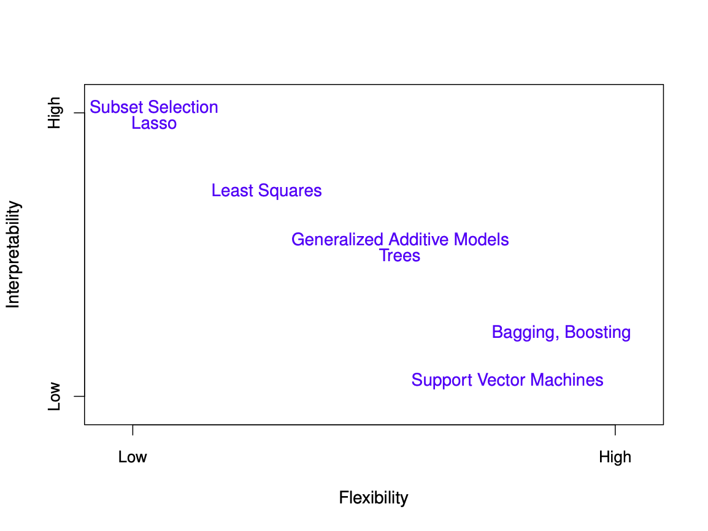

# **Today's learning goals:**

-   Assume we have several possible models

-   How to evaluate and choose the best

    -   Train-test splits,

    -   Leave out one cross validation,

    -   K-fold cross validation,

    -   Bootstrap,

    -   AIC, BIC combined with search

        -   forward

        -   backward

        -   full enumeration

    -   Bayes

-   A bit of math, but (**no stress**) technical details are not too critical to follow

# **Recap**

-   Two cultures in R: base R and tidyverse (find your own, but today we shall use base R)

-   Basic statistical models and tests on Monday

-   Simulation and bootstrap on Tuesday

# Regression and MSE

-   Regression: $Y=f(\boldsymbol x)+\varepsilon$, where $f(\boldsymbol x)$ can be linear combination or a neural network, or any **suitable statistical model** really and $\varepsilon$ independent from $f(\boldsymbol x)$ with $E[\varepsilon] = 0$ and $Var[\varepsilon] = \sigma^2$

-   No normality is assumed here!

-   $\widehat Y=\hat f(\boldsymbol x)$ based on $\{(\boldsymbol x_1,y_1),...,(\boldsymbol x_n,y_n)\}$

-   Assume prediction of $Y_\text{new}$ for new $\boldsymbol x$ from $Y_\text{new}=f(\boldsymbol x_\text{new})+\varepsilon$ and $\widehat Y_\text{new} = \hat f(\boldsymbol x_\text{new})$,

-   Note: $\Rightarrow\varepsilon$ is independent of $\widehat Y_\text{new}$!

-   **Evaluation of the model requires an estimate of MSE!**

    $\text{MSE}(\boldsymbol x_\text{new}):=E[(\widehat Y_\text{new}-Y_\text{new})^2]\ =E[(\widehat Y_\text{new}-f(\boldsymbol x_\text{new})-\varepsilon)^2]$=[additivity of expectations]

    $E[(\widehat Y-f(\boldsymbol x_\text{new}))^2]$ -$2E[(\widehat Y_\text{new} - f(\boldsymbol x_\text{new}))\varepsilon]+E[\varepsilon^2]$

    $=E[(\widehat Y_\text{new}-f(\boldsymbol x_\text{new}))^2]+\sigma^2$ , the latter ($\sigma^2$) is irreducible error

    # Bias-variance trade off

    **Further,** we have $E[(\widehat Y_\text{new}-f(\boldsymbol x_\text{new}))^2]$

    $=E[(\widehat Y_\text{new}-E[\widehat Y_\text{new}]+E[\widehat Y_\text{new}]-f(\boldsymbol x_\text{new}))^2]$

    $=E[(\widehat Y_\text{new}-E[\widehat Y_\text{new}])^2]+E[(E[\widehat Y_\text{new}]-f(\boldsymbol x_\text{new}))^2$

    $+2E[(\widehat Y_\text{new}-E[\widehat Y_\text{new}])(E[\widehat Y_\text{new}]-f(\boldsymbol x_\text{new}))]$

    $=\text{Var}[\widehat Y_\text{new}]+(E[\widehat Y_\text{new}]-f(\boldsymbol x_\text{new}))^2$ $=\text{Variance}+\text{bias}^2$!!!

    {width="376"}

    -   **Two sources of error: Bias and Variance.**
    -   Ideally we want both small

    ------------------------------------------------------------------------

    **Bias as Modelling Error:**

    -   Bias is the error from using a simplification of the real world.

    -   Every model involves some degree of simplification.

    -   Bias is also known as '**modelling error**'.

    -   The smaller the neighborhood, the smaller the bias.

    ------------------------------------------------------------------------

    **Variance:**

    -   Variance - The '**estimation error**'.

    -   More data points lead to smaller estimation error.

    -   More data per parameter reducing estimation error.

    ------------------------------------------------------------------------

    **Trade-off: Bias vs. Variance:**

    -   **Classical trade-off between bias and variance**.

    -   Difficult to have both ways unless we found **the true data generative mechanism**.

    -   Need to balance between bias and variance

    ------------------------------------------------------------------------

    **Conclusion:**

    -   Extremes in either direction result in a useless fitted model.

    -   *Finding the right balance is crucial in model fitting.*

[{width="425"}](https://www.google.com/url?sa=i&url=https%3A%2F%2Fwww.cs.cornell.edu%2Fcourses%2Fcs4780%2F2018fa%2Flectures%2Flecturenote12.html&psig=AOvVaw2N0zagZ6T3YGdRdg2g0TLU&ust=1705756350701000&source=images&cd=vfe&opi=89978449&ved=0CBMQjRxqFwoTCIiXofbD6YMDFQAAAAAdAAAAABAI)

# "Average" over many $\boldsymbol x$'s MSE

-   $\text{MSE}(\boldsymbol x)=E[(\widehat Y(\boldsymbol x)-Y(\boldsymbol x))^2]$ only related to one $\boldsymbol x$ (n/b I changed the notation a bit)

-   In practice: Want to do predictions on **many** furture $\boldsymbol x$

-   We do not know these, but assume they are drawn from som distribution $p(\boldsymbol x)$

-   More natural to look at $$
    E[\text{MSE}(\boldsymbol x)]=\int_{\boldsymbol x}\text{MSE}(\boldsymbol x)p(\boldsymbol x)d\boldsymbol x=E^{p(\boldsymbol x)}[E[(\widehat Y(\boldsymbol x)-Y(\boldsymbol x))^2]]
    $$

# Estimation of MSE

$$E[\text{MSE}(\boldsymbol x)]=\int_{\boldsymbol x}\text{MSE}(\boldsymbol x)p(\boldsymbol x)d\boldsymbol x$$

$$=E_{p(\boldsymbol x)}[E[(\widehat Y(\boldsymbol x)-Y(\boldsymbol x))^2]]$$

-   $p(\boldsymbol x)$ unknown, but we can use the Monte-Carlo approximation:

-   $\int_{\boldsymbol x}\text{MSE}(\boldsymbol x)p(\boldsymbol x)d\boldsymbol x$ $\approx \frac{1}{n}\sum_{i=1}^n\text{MSE}(\boldsymbol x_i)$ $=\frac{1}{n}\sum_{i=1}^nE[(\widehat Y(\boldsymbol x_i)-Y(\boldsymbol x_i))^2]\text{ is unbiased}$

-   "Obvious estimate": $\frac{1}{n}\sum_{i=1}^n(\widehat y_i-y_i)^2$

-   $Y(\boldsymbol x)$ assumed independent of $\widehat Y(\boldsymbol x)$

-   But $\widehat Y(\boldsymbol x)$ is based on $\{(\boldsymbol x_i,y_i),i=1,...,n\}$

-   Thus $\widehat y_i$ depends of $y_i$

-   Using "**training"** data to estimate **MSE** leads to underestimation of error (aka optimism)

```{r}
#let us recall yesterday and simulate some data for us to learn what I talked about above
dataset <- data.frame(x = runif(100,1,10))
dataset$y.yesterday <- rnorm(100,dataset$x,5)
dataset$y.tomorrow <- rnorm(100,dataset$x,5)
#same conditional distribution for both days
boxplot(dataset$y.yesterday,dataset$y.tomorrow)

#by attaching a dataset, it is searched by R when evaluating a variable, so objects in the database can be accessed by simply giving their names.
attach(dataset)

polinomio <- function(p) if(p==0) lm(y.yesterday~1) else lm(y.yesterday~poly(x,p))
#apply linear model and then polunomials of up to order 23
polinomi <- apply(cbind(0:23), 1, polinomio)


#make predictions for tomorrow for all the polynomial models
y.hat <- lapply(polinomi, predict)


mse.train <- function(y.hat) mean((y.yesterday-y.hat)^2)
mse.yesterday <- as.numeric(lapply(y.hat, mse.train))

mse.test <- function(y.hat) mean((y.tomorrow-y.hat)^2)
mse.tomorrow <- as.numeric(lapply(y.hat, mse.test))

boxplot(cbind(mse.yesterday,mse.tomorrow))

```

Let us plot the results for all polynomials in base R

```{r}
plot(0:23, sqrt(mse.yesterday), type="b", xlab="p", ylab="RMSE", ylim=sqrt(c(min(c(mse.yesterday,mse.tomorrow)),max(c(mse.yesterday,mse.tomorrow)))))
lines(0:23,sqrt(mse.tomorrow),type = "b", col = 2)
legend("topright", legend = c("Yesterday", "Tomorrow"), col = c(1, 2), pch = 1:1, lty = 1:1)
```

# **Methods for Model Selection**

1.  **Main Problem:**

    -   Need a separate data set for evaluation.

2.  **Possible Approaches:**

    -   One training set and one test set.

    -   Cross-validation.

    -   Bootstrapping

    -   Correcting for underestimation/optimism.

        -   Criteria based on information.

# **Training and Test Sets**

1.  **Divide the Full Dataset:**

    -   Randomly into two disjoint datasets

        -   **Training Set:**

            -   Used to estimate/train the model

        -   **Test Set:**

            -   Used to evaluate the model

2.  **Prototype Example:**

    -   Refer to the prototype example provided earlier.

3.  **Strengths:**

    -   Independent dataset for evaluation

    -   Easy to apply

    -   Easy to understand

4.  **Weaknesses:**

    -   Reduces the dataset used for training the model

        -   Not a problem if huge amounts of data are available

    -   If the same test set is used to choose between models, the final error measure will be too optimistic

        -   For $X_1,...,X_p$ all have $E[X_i]=\mu$, $\hat\mu=\min\{X_1,...,X_p\}$ will have $E[\hat\mu]<\mu$.

**Including Validation Set**

1.  **Divide the Full Data-set:**

    -   Randomly into three disjoint data-sets

        -   **Training Set:**

            -   Used to estimate/train the model

        -   **Validation Set:**

            -   Used to select the model

        -   **Test Set:**

            -   Used to evaluate the final model

        -   **Weakness:**

            -   Requires large data-sets

```{r}

library(ISLR)

formel <- balance ~ 1 + as.factor(student) + as.factor(default) + poly(income,8)
fit.lm <- lm(formel,data=Default)
summary(fit.lm)


#In-sample prediction error
y.pred <- predict(fit.lm,Default)
RMSE.insamp <- sqrt(mean((Default$balance-y.pred)^2))

set.seed(2)
n <- nrow(Default)
ind <- sample(1:n,n/2,replace=FALSE)
fit <- lm(formel,data=Default[ind,])
pred <- predict(fit,Default[-ind,])
sqrt(mean((Default$balance[-ind]-pred)^2))

#Splitting into train and test, repeating several times
n <- nrow(Default)
B <- 20
RMSE.train.test <- rep(NA,B)
for(b in 1:B)
{
  ind <- sample(1:n,n/2,replace = FALSE)
  fit <- lm(formel,data = Default[ind,])
  pred <- predict(fit,Default[-ind,])
  RMSE.train.test[b] <- sqrt(mean((Default$balance[-ind]-pred)^2))
}


```

Another plot in base R

```{r}
boxplot(RMSE.train.test)
abline(h = RMSE.insamp, col = "red", lty = 2, lwd = 2)
legend("topright", legend = c("Train-Test RMSE", "In-Sample RMSE"), col = c(1, 2), lty = 1:2)

```

# **Leave-One-Out Cross-Validation**

**Leave-One-Out Cross-Validation**

1.  **Objective:**

    -   Maximize the size of the training set.

2.  **Data Split:**

    -   The training set should be as large as possible.

    -   A separate test set is still needed.

3.  **Cross-Validation Process:**

    -   Predict $y_i$ by $\hat y_{-i}$ (all observations except $(y_i,\boldsymbol x_i)$)

    -   Estimate Mean Squared Error (MSE) by:

        $\widehat{\text{MSE}}_{LOO} =\sum_{i=1}^n(y_i-\hat y_{-i})^2$

4.  **Strengths:**

    -   Using (almost) all data for training.

    -   Using all data as test.

5.  **Weaknesses:**

    -   Using (slightly) different models for each prediction.

    -   Computationally intensive (i am not using mclapply on purpose to show that!).

```{r}
n <- nrow(Default)
y.cv <- rep(NA,n)
for(i in 1:n)
{
  f <- lm(formel,data=Default[-i,])
  y.cv[i] <- predict(f,Default[i,])
}

RMSE.loo <- sqrt(mean((Default$balance-y.cv)^2))
cat("In sample was ", RMSE.insamp, "and LOO-CV is ",RMSE.loo)
```

Let us add to our plot

```{r}
boxplot(RMSE.train.test)
abline(h = RMSE.insamp, col = 2, lty = 2, lwd = 2)
abline(h = RMSE.loo, col = 3, lty = 2, lwd = 2)
legend("topright", legend = c("Train-Test RMSE", "In-Sample RMSE", "LOO-CV RMSE"), col = c(1, 2, 3), lty = c(1,2,2))

```

# $K$**-Folded Cross-Validation**

1.  **Data Split:**

    -   Divide the data into $K$ groups.

2.  **Observation Prediction:**

    -   For an observation $y_i$ that belongs to group $k_i$, construct $\hat y_i^K$ by using data from all groups **except group** $k_i$}

3.  **Estimate Mean Squared Error (MSE):**

    -   Use the formula:

        $\widehat{\text{MSE}}_{CV-K}=\sum_{i=1}^n(y_i-\hat y_{-i}^K)^2$

4.  **Strengths (Compared to LOO-CV):**

    -   Only need to train \$K\$ models, less computationally intensive.

    -   All observations are still used as tests.

5.  **Weaknesses:**

    -   Using **more** different models for each prediction.

```{r}

#K-fold CV
K <- 5
nk <- n/K
RMSE.Kcv <- rep(0,K)
for(b in 1:K)
{
  pred.K <- rep(NA,n)
  ind <- sample(1:n,n,replace=FALSE)   #Permutation of data
  for(k in 1:K)
  {
    ind2 <- ind[(k-1)*nk + 1:nk]
    f <- lm(formel,data=Default[-ind2,])
    pred.K <- predict(f,Default[ind2,])
    RMSE.Kcv[b] <- RMSE.Kcv[b] + sum((Default$balance[ind2]-pred.K)^2)/n
  }
}
RMSE.Kcv <- sqrt(RMSE.Kcv)

cat("In sample was ", RMSE.insamp, ", LOO-CV was ",RMSE.loo, "and K-fold-CV is ",mean(RMSE.Kcv))
```

And let us plot that

```{r}
boxplot(RMSE.train.test)
abline(h = RMSE.insamp, col = 2, lty = 2, lwd = 2)
abline(h = RMSE.loo, col = 3, lty = 2, lwd = 2)
abline(h = mean(RMSE.Kcv), col = 4, lty = 2, lwd = 2)
legend("topright", legend = c("Train-Test RMSE", "In-Sample RMSE", "LOO-CV RMSE", "K-fold-CV RMSE"), col = c(1, 2, 3, 4), lty = c(1,2,2,2))
```

# **Bootstrap evaluation of out-of-Sample MSE**

1.  **Bootstrap Method:**

    -   Resample training data with replacement from the original dataset.

    -   Use the data that did not end up in training set as the test set

2.  **Observation Prediction:**

    -   For each bootstrap sample, fit the model on the training set and evaluate performance on the corresponding test set.

3.  **Estimate Out-of-Sample MSE:**

    -   Use the formula:

        $\widehat{\text{MSE}}_{Bootstrap} =\sum_{i=1}^{n^*}(y_i-\hat y_{-i}^K)^2$

    -   where $B$ is the number of bootstrap samples.

4.  **Strengths:**

    -   Flexible and applicable to various models.

    -   Does not assume a specific data split.

    -   Gives a full distribution of the MSE

5.  **Weaknesses:**

    -   Computationally intensive for large **datasets**.

    -   May not be suitable for highly dependent data (spatio-temporal data).

```{r}
# Bootstrap Validation with Out-of-Bag Predictions
B <- 1000  # Number of bootstrap samples
RMSE.bootstrap <- rep(0, B)

set.seed(123)  # Set seed for reproducibility

for (b in 1:B) {
  pred.bootstrap <- rep(NA, n)
  ind <- sample(1:n, n, replace = TRUE)  # Bootstrap sampling with replacement

  ind_out_of_bag <- setdiff(1:n, ind)  # Indices not in the current bootstrap training set

  f <- lm(formel, data = Default[ind,])  # Fit model using bootstrap sample
  pred.bootstrap[ind_out_of_bag] <- predict(f, Default[ind_out_of_bag,])  # Make predictions for out-of-bag indices

  RMSE.bootstrap[b] <- sqrt(sum((Default$balance[ind_out_of_bag] - pred.bootstrap[ind_out_of_bag])^2) / length(ind_out_of_bag))
}

boxplot(RMSE.bootstrap)

cat("In sample was ", RMSE.insamp, ", LOO-CV was ", RMSE.loo, "and Bootstrap Validation is ", mean(RMSE.bootstrap))

```

and let us plot the graphs

```{r}
boxplot(RMSE.train.test,RMSE.bootstrap)
abline(h = RMSE.insamp, col = 2, lty = 2, lwd = 2)
abline(h = RMSE.loo, col = 3, lty = 2, lwd = 2)
abline(h = mean(RMSE.Kcv), col = 4, lty = 2, lwd = 2)
```

not too large difference between in sample errors and our more advanced methods here, but even more flexible methods like higher order polynomials or neural networks would typically suffer from the "red" line being far below other lines in our box-plot.



# **Criteria-Based Methods**

-   **Challenges:**

    -   Sparse data, constrained computational power, or difficult to divide the data-set.

-   **Within-Sample Estimate:**

    -   $MSE = \sum_{i=1}^n(y_i - \hat y_i)^2$ is underestimated.

-   **Regression with Gaussian Noise:**

    $\log L(\hat\theta) =\sum_{i=1}^n[-0.5\log(2\pi)-0.5\log(\hat\sigma^2)-0.5(y_i-\hat y_i)^2] =\text{Const.}-0.5n\log(\hat\sigma^2)-0.5\sum_{i=1}(y_i-\hat y_i)^2$

-   **General Case:**

    -   $\log L(\hat\theta)$ will overestimate the true $\log L(\theta^{true})$.

-   **Correction:**

    -   Can we correct for this?

    -   Information-based criteria:

        $\text{IC} = -2\log L(\hat\theta)+\text{penalty}(p), \quad p=|\theta|$

-   **Model Selection Criteria:**

    -   Different choices of penalty identify different **model selection** criteria.

-   **Penalty Consideration:**

    -   Penalty should increase with $p$.

# Some popular IC

**AIC:**

-   $\text{AIC}=-2\log(L(\hat{\boldsymbol\theta}))+2|\boldsymbol\theta|$

-   Will typically include too many variables.

**BIC:**

-   $\text{BIC} = -2\log(L(\hat{\boldsymbol\theta})) + \log(n)|\boldsymbol\theta|$.

-   Penalizes more complex models **harder**.

**AIC and BIC:**

-   Can also be used \\alert{outside linear models}.

**Information Criteria - Pros and Cons**

1.  **Non-Nested Models:**

    -   Can be used for non-nested models (in contrast to likelihood ratio tests).

2.  **Direct Application to Data:**

    -   Work directly on all data at hand.

        -   Can also be used for **dependent** data.

3.  **Efficiency:**

    -   Require fitting/training fewer models.

4.  **Assumption Reliance:**

    -   Rely more heavily on model assumptions than cross-validation or bootstrap.

# **Variable Selection**

1.  **Model Set:**

    -   Assume a \\alert{set} of models obtained by selection from a set of explanatory variables.

        -   $S = {1, x_1, x_2, ..., x_q}$.

2.  **Automatic Procedure:**

    -   Select the subset that minimizes AIC, BIC (or a similar criterion).

3.  **Combinatorial Challenge:**

    -   In total, $2^q$ possible subsets, making it impossible to consider all.

4.  **Stepwise (Forward) Selection:**

    -   Start with $S_0 = {1}$.

    -   Find $x_j$ such that $S_1 = {1, x_j}$ is the best among all ${1, x_k}$ for $k = 1, ..., q$.

    -   Find $x_k$ such that $S_1 = {1, x_j, x_k}$ is the best among all ${1, x_j, x_l}$ for $l \neq j$.

    -   $\vdots$

    -   Stop when no improvement in AIC/BIC.

5.  **Alternative:**

    -   Backwards selection.

6.  **Challenges:**

    -   Main problem: Computationally costly.

Let us take a look at an example in R

```{r}
#Hitters data
library(ISLR)


data(Hitters)
head(Hitters)
dim(Hitters)
??Hitters


sum(is.na(Hitters$Salary))
Hitters <- na.omit(Hitters)
dim(Hitters)

n <- nrow(Hitters)
fit.lm <- lm(Salary~.,data=Hitters)
summary(fit.lm)


library(leaps)
#Forward selection
nvmax <- 20
# Since this function returns separate best models of all sizes up to nvmax and since different model selection criteria such as AIC, BIC, #... differ only in how models of different sizes are compared, the results do not depend on the choice of cost-complexity tradeoff.
regfit.fwd <- regsubsets(Salary~.,data=Hitters,nvmax=nvmax,method="forward") # to change to backward, use method = "backward"

summary.regfit.fwd = summary(regfit.fwd)
show(summary.regfit.fwd)

#r2 and adjr2
matplot(cbind(summary.regfit.fwd$rsq,summary.regfit.fwd$adjr2),type="l", ylab="R^2 and adj-R^2")
#bic
plot(summary.regfit.fwd$bic,type="l")

#aic
summary.regfit.fwd$aic <- summary.regfit.fwd$bic-log(n)*(c(1:nvmax)+2)+2*(c(1:nvmax)+2)
plot(summary.regfit.fwd$aic,type="l")

matplot(cbind(summary.regfit.fwd$aic,summary.regfit.fwd$bic),type="l",lty=1,ylab = "IC")
#best models
p.aic <- which.min(summary.regfit.fwd$aic)
p.bic <- which.min(summary.regfit.fwd$bic)
```

and plot the selected number of variables

```{r}
matplot(cbind(summary.regfit.fwd$aic,summary.regfit.fwd$bic),type="l",lty=1,ylab = "IC")
points(c(p.aic,p.bic),
       c(summary.regfit.fwd$aic[p.aic],summary.regfit.fwd$bic[p.bic]))
legend("topright",c("AIC","BIC"),lty=1,col=1:2)
```

let us allow for interactions

```{r}
#now include interactions
nvmax <- 150
regfit.fwd <- regsubsets(Salary~.^2-NewLeague^2,data=Hitters,nvmax=nvmax,method="forward")
summary.regfit.fwd <- summary(regfit.fwd)


#r2 adjr2
matplot(cbind(summary.regfit.fwd$rsq,summary.regfit.fwd$adjr2),type="l",ylab="R^2 and adj-R^2")

#bic
plot(summary.regfit.fwd$bic,type="l")
which.min(summary.regfit.fwd$bic)

#aic
summary.regfit.fwd$aic = summary.regfit.fwd$bic-log(n)*(c(1:nvmax)+2)+2*(c(1:nvmax)+2)
plot(summary.regfit.fwd$aic,type="l")
which.min(summary.regfit.fwd$aic)


#both
matplot(cbind(summary.regfit.fwd$aic,summary.regfit.fwd$bic),type="l",lty=1,ylab = "IC")
#best models
p.aic = which.min(summary.regfit.fwd$aic)
p.bic = which.min(summary.regfit.fwd$bic)


```

and let us plot optimal solutions

```{r}
matplot(cbind(summary.regfit.fwd$aic,summary.regfit.fwd$bic),type="l",lty=1,ylab = "IC")
points(c(p.aic,p.bic),
       c(summary.regfit.fwd$aic[p.aic],summary.regfit.fwd$bic[p.bic]))
legend("topright",c("AIC","BIC"),lty=1,col=1:2)


```

# **All Subsets Model Selection**

1.  **Consideration of All Subsets:**

    -   Evaluate all $2^p$ possible subsets of explanatory variables.

2.  **Exhaustive Search:**

    -   Assess each subset's performance based on model selection criteria (e.g., AIC).

3.  **Combinatorial Challenge:**

    -   Evaluating all subsets becomes impractical for large $p$.

4.  **Advantages:**

    -   Comprehensive exploration of potential models.

5.  **Drawbacks:**

    -   Computationally intensive and infeasible for high-dimensional datasets.

```{r}
regfit.full <- regsubsets(Salary~.,data=Hitters,nvmax=20, method="exhaustive")
reg.summary <- summary(regfit.full)
matplot(cbind(1:19,1:19),
        cbind(reg.summary$rsq,reg.summary$adjr2),
        type="l",lty=1,col=1:2,
        xlab="d",ylab="R^2/R^2 adjusted")


plot(1:19, reg.summary$bic,
        type="l",lty=1,ylab="BIC")
print(which.min(reg.summary$bic))


#but already infeasible with interactions
#nvmax <- 150
#regfit.full.int <- regsubsets(Salary~.^2-NewLeague^2,data=Hitters,nvmax=nvmax,method="exhaustive",really.big=T)

```

# Bayesian **Model Selection**

1.  **Bayesian Approach:**

    -   Utilizes Bayesian principles for model selection allowing to estimate **probability** of inclusion (selection) for each effect.
    -   Thus we have uncertainty regarding the model selection

2.  **Posterior Probability:**

    -   Assigns a posterior probability to each model from the full subsets but estimated through MCMC, making it feasible!

3.  **Model Comparison:**

    -   Compares models based on their posterior probabilities.

4.  **Advantages:**

    -   Incorporates prior knowledge.

    -   Provides a probabilistic framework for model evaluation.

5.  **Considerations:**

    -   Requires specifying prior distributions, which may be subjective (not talk about today).

    -   Computationally intensive for complex models (yet better than all subsets selection).

6.  **Brief Overview:**

    -   Bayesian model selection offers a probabilistic alternative to frequentist criteria.

```{r}

library(BAS)

regfit.full.bayes <- bas.lm(Salary~.,data=Hitters)
coef(regfit.full.bayes)

```

now feasible with interactions

```{r}
regfit.full.bayes.interact <- bas.lm(Salary~.^2-NewLeague^2,data=Hitters)
coef(regfit.full.bayes.interact)
```

## **Exercises - replace loops with sapply/lapply/mclapply** 

Replace loops with sapply/lapply/mclapply functions for leave-out-one cross validation, K-fold cross validation, and bootstrap procedure

## **Exercises - classification of bacteria again**

Expand exercise on classification of bacteria, and implement a cross-validation to estimate the CER (classification error rate) (**not RMSE!**). Use K values 1,2,…,10. Compute the CER for each choice of K. Do the same with bootstrapping.

Can you make a boxplot that both illustrates the error for each choice of K and at the same time also the variability between segments? Then do the boxplot for bootstrapping.
